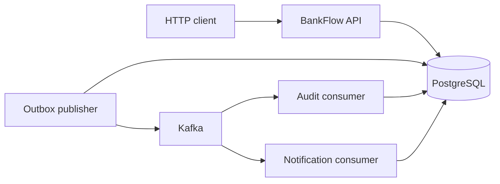
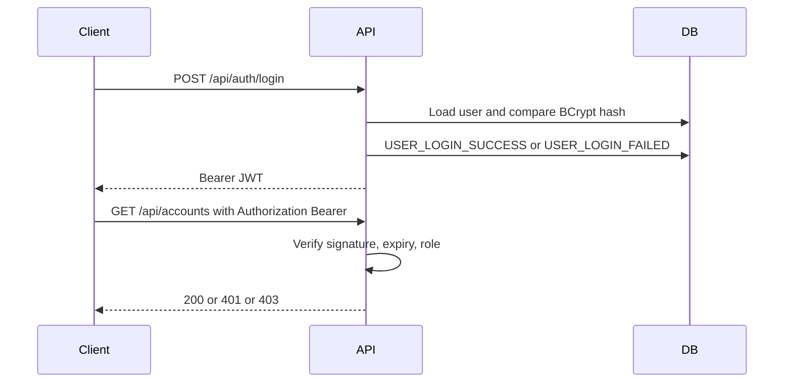
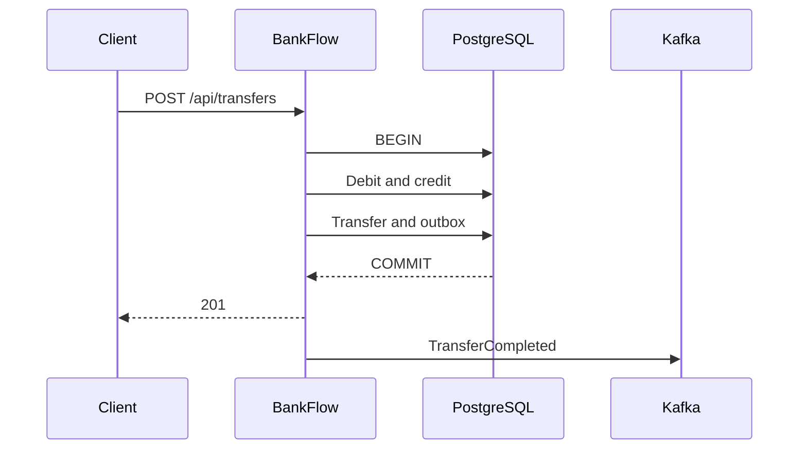
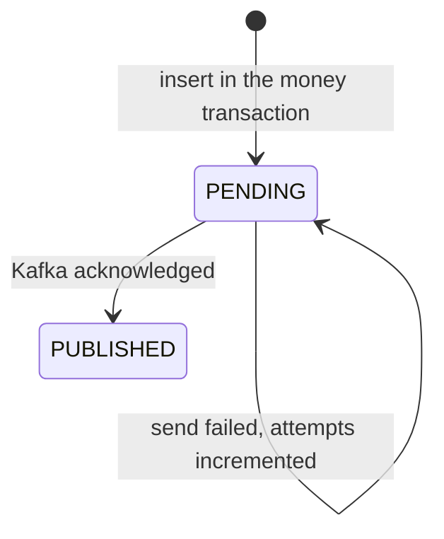
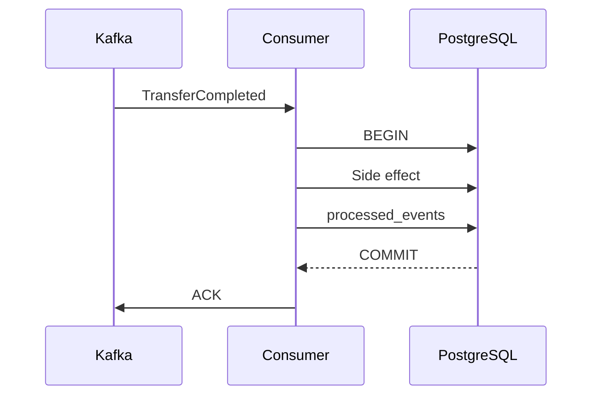

# BankFlow architecture

BankFlow is one Spring Boot application. PostgreSQL holds the balances. Kafka carries `TransferCompleted` after the money transaction has committed.

## 1. System architecture

The API process also runs the publisher and both consumers. They are threads in the modular monolith, not separate services.

## 2. Module structure

| Package | Responsibility |
| --- | --- |
| `auth` | Register, login, JWT filter, authorization rules |
| `user` | `CUSTOMER` and `ADMIN` |
| `account` | Open and read accounts. Balance changes only through account methods used by transfers |
| `transfer` | Validation, locking, debit, credit, transfer row |
| `idempotency` | Key claim, SHA-256 fingerprint, replay |
| `transaction` | Read model over `Transfer` |
| `outbox` | Outbox row and Kafka publish |
| `event` | Decode a transfer event and record `processed_events` |
| `audit` | Append-only audit rows and the admin query |
| `notification` | In-app notifications |
| `common` | Errors, health, correlation id, Jackson, OpenAPI |

## 3. Authentication flow

Registration always stores `CUSTOMER`. `JWT_SECRET` comes from the environment and must be at least 32 bytes. `JWT_EXPIRATION` is seconds. The secret is not logged.

## 4. Transfer flow

Kafka is called by the publisher after the commit, in a later transaction. The HTTP response does not wait for consumers.

Invariants:

- amount is greater than zero and has at most four decimal places
- source and destination differ
- currencies match
- the caller owns the source account
- the source balance covers the amount
- neither balance goes negative
- both accounts are active
- debit, credit, transfer, idempotency completion, and outbox insert commit or roll back together

`Account.balance` changes on account creation (zero) and on transfer debit or credit. No API accepts a client-supplied balance.

## 5. Idempotency flow

The key is required and stored with the user id. The unique constraint is `(user_id, idempotency_key)`. The fingerprint covers source, destination, amount at scale 4, and currency.

Same key and same fingerprint: return the original transfer with **200**. Same key and different fingerprint: **409**. A failed business rule rolls the claim back. Two concurrent requests with the same key are serialized by the unique index. The loser replays the winner.

## 6. Outbox flow

The publisher reads only `PENDING` rows, using `FOR UPDATE SKIP LOCKED`. `PUBLISHED` is set after the send returns. `lastError` and `attempts` are stored on failure. That failure does not roll back the transfer.

## 7. Kafka consumer flow

The acknowledgement is after the commit. A database error skips the acknowledgement, and Kafka redelivers. Audit and notifications use different consumer groups, so each group sees the event. Consumers load the transfer from PostgreSQL. The payload amount is not the authority for the balance.

A malformed body, an unexpected type, an unsupported `eventVersion`, or a missing transfer is logged and acknowledged so the partition can move on.

## 8. Audit flow

Login, registration, and account creation write audit rows in the caller's transaction. Login failure uses a separate transaction so the row remains after the login error rolls back. `TRANSFER_COMPLETED` is written by the audit consumer. The admin list is append-only from the API. Metadata excludes passwords, hashes, tokens, and the `Authorization` header.

## 9. Notification flow

The notification consumer writes `TRANSFER_SENT` and, when the receiver is a different user, `TRANSFER_RECEIVED`. The unique key is the user, the type, and the transfer id. Mark-read operations filter by the authenticated user. Another user's notification id is **404**.

## 10. Failure scenarios

| Failure | Money | What remains |
| --- | --- | --- |
| Validation or insufficient balance | Rolled back | Idempotency key is not consumed |
| Crash inside the money transaction | Rolled back | No transfer and no outbox row |
| Kafka down after commit | Stays committed | Outbox stays `PENDING` and retries |
| Crash after Kafka ack, before `PUBLISHED` | Stays committed | The same event can be published again |
| Consumer database error | Untouched | Record is not acknowledged |
| Duplicate event | Untouched | `processed_events` makes the side effect a no-op |

## 11. Concurrency strategy

Account locks are pessimistic and ordered by account UUID. That covers two debits of one balance and transfers in opposite directions. Idempotency inserts rely on the unique index. The outbox poll uses skip-locked so two publishers would not take the same row. That second publisher was not run as a separate process.

## 12. Data consistency model

Balances, transfers, idempotency, and the outbox row are strongly consistent inside one PostgreSQL transaction. Audit rows and notifications are eventually consistent with that transfer. Money uses `BigDecimal` and `NUMERIC(19, 4)` everywhere it is stored or sent on Kafka. Display text in a notification may show two decimal places. That rounding is not written back to the balance.

`X-Correlation-Id` is for logs only.

Health is split on purpose:

- `GET /api/health` — the process answers HTTP
- readiness — the process and PostgreSQL
- `GET /api/health/kafka` — the broker, without taking the API out of service

A Kafka outage does not mean a transfer cannot be accepted.
